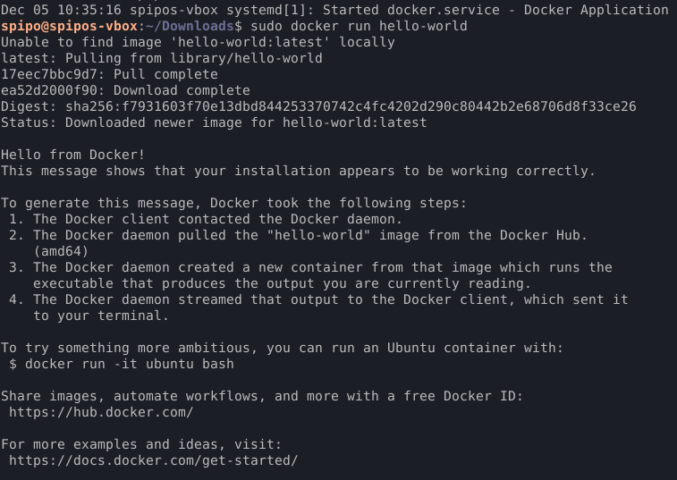
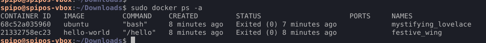
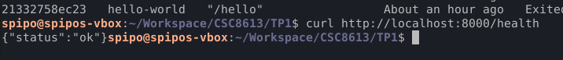
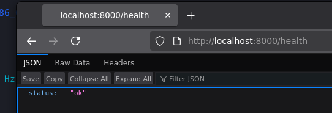
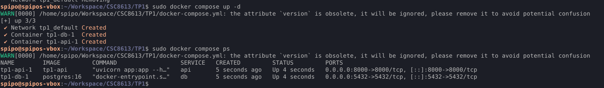
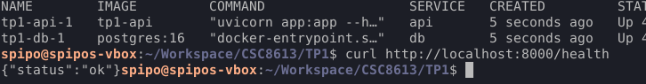
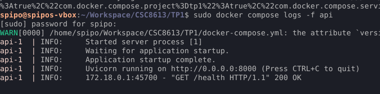
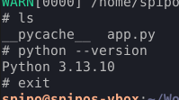
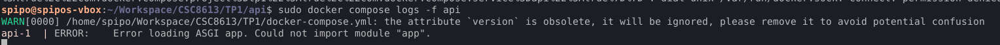

# Exercice 1 : Installation de Docker et vérification de l’environnement
## Question 1.b.
  
_Docker est correctement installé_
## Question 1.c.
  
_Résultat de la commande docker ps -a_
Cette commande `docker ps -a` liste l’ensemble des conteneurs présents sur le système. Le paramètre `-a` permet de lister tous les conteneurs, et sans lui, seuls les conteneurs en cours d’exécution sont listés.
# Exercice 2 : Premiers pas avec Docker : images et conteneurs
## Question 2.a.
Une image dans Docker est un “template” qu’on applique sous forme de conteneurs, qui en sont des instances. Ça s’apparente au modèle classe/objet qu’on retrouve dans des langages de programmation, avec les images représentant les classes et les conteneurs représentant des objets y appartenant.
## Question 2.b.
Après exécution de ce code, comme expliqué en partie dans le `docker run hello-world` exécuté pour l'exercice 1 :
- Le client Docker a contacté le daemon Docker ;
- Le daemon Docker a fait un "pull" de l'image "alpine" depuis le Docker Hub ;
- Il a ensuite créé un nouveau conteneur depuis cette image ;
- Il a fait tourner la commande `echo "Bonjour depuis un conteneur Alpine"` sur le conteneur en question.
## Question 2.c.
C'est parce qu'après que tout le code donné soit exécuté, Docker n'a plus rien a exécuter et ferme proprement le conteneur. Un conteneur reste en "Running" uniquement tant que son processus PID 1 tourne.
## Question 2.d.

_Résultat des commandes_
Je constate que le conteneur tourne sur la même version que la machine hôte, ce qui nous avait été expliqué en cours (comme quoi les conteneurs partagent le même noyau que leur machine hôte).
# Exercice 3 : Construire une première image Docker avec une mini-API FastAPI
## Question 3.a.
app.py complété :
```python
from fastapi import FastAPI 

app = FastAPI() 

@app.get("/health") 
def health(): 
	return {"status": "ok"}
```
## Question 3.b.
Dockerfile complété : 
```Dockerfile
FROM python:3.13-slim
WORKDIR /app 
COPY app.py . 
RUN pip install fastapi uvicorn 
CMD ["uvicorn", "app:app", "--host", "0.0.0.0", "--port", "8000"]
```
## Question 3.c.

_Le conteneur s'est bien construit avec les fichiers complétés plus tôt dans cet exercice_
# Exercice 4 : Exécuter l’API FastAPI dans un conteneur Docker
## Question 4.a.
Le paramètre `-p 8000:8000` associe le port 8000 du conteneur au port 8000 de la machine hôte. Ça agit un peu comme un "mapping", et ici ça nous permet d'accéder à l'API health depuis la machine hôte (via curl ou un navigateur Web)
## Question 4.b.

_Réponse attendue avec curl..._

_...et dans un navigateur Web depuis l'hôte._
## Question 4.c.

_Résultat de la commande docker ps_
La seule ligne qui apparaît est la ligne qui correspond au conteneur `simple-api`, vu qu'on n'a pas ajouté le paramètre `-a`.
- Le nom du conteneur est un nom généré automatiquement car je n'ai pas spécifié de nom à sa construction. Ici, c'est `elated_hofstadter`.
- L'image utilisée est l'image `simple-api`.
- Le port mappé est le port `8000`, comme vu dans la colonne `PORTS` sur la capture d'écran.
## Question 4.d.

_ps et ps -a après avoir run docker stop 269d2b5a28e5_
La différence entre ces deux commandes, `docker ps` et `docker ps -a`, est que le paramètre `-a` fait en sorte que la commande liste tous les conteneurs, contre seulement les conteneurs en cours d'exécution sans lui.
# Exercice 5 : Démarrer un mini-système multi-conteneurs avec Docker Compose
## Question 5.b.
`docker-compose.yml` complété : 
```yml
version: "3.9" 

services: 
	db: 
		image: postgres:16 
		environment: 
			POSTGRES_USER: demo 
			POSTGRES_PASSWORD: demo 
			POSTGRES_DB: demo 
		ports: 
			- "5432:5432" 
			  
	api: 
		build: ./api 
		ports: 
			- "8000:8000" 
		depends_on: 
			- db
```
## Question 5.c.

_Les services db et api sont bien démarrés et en route_
## Question 5.d.

_L'API fonctionne bien correctement_
## Question 5.e.
La différence est que `docker-compose down` arrête et retire complètement tout ce qui a été créé par `docker-compose up` (réseaux, volumes, images), et docker stop ne fait qu'arrêter les containers en cours d'exécution sans les retirer (ce qui permet de pouvoir les remettre en route par la suite).
# Exercice 6 : Interagir avec la base de données PostgreSQL dans un conteneur
## Question 6.a.
- `exec` permet d'exécuter une commande dans un container en marche
- `db` spécifie le service dans lequel exécuter la commande (ici `db`)
- `-U demo` fait en sorte que ça se connecte en tant qu'utilisateur PostgreSQL "`demo`"
- `-d demo` fait en sorte que ça se connecte à la basse de données "`demo`"
## Question 6.b.

_Résultats des commandes PostgreSQL_
On constate que la version de PostgreSQL est 16.11, que PostgreSQL est compilé par `gcc` (qui provient de l'hôte), et que la base de données courante est `demo`.
## Question 6.c.
Dans notre cas : 
- Le hostname à utiliser est `db`, comme défini dans le `docker-compose.yml` ;
- Le port à utiliser est 5432 (et non pas le port mappé sur l'hôte 5432:5432, celui-ci n'étant utile qu'en cas de connexion externe)
- Le nom d'utilisateur est le mot de passe sont tous deux `demo`, comme indiqué dans le `docker-compose.yml`.
L'API (ou d'autres services Docker) peut s'y connecter de manière automatique avec ces variables spécifiées, au travers du réseau interne généré par Docker. 
# Exercice 7 : Déboguer des conteneurs Docker : commandes essentielles et bonnes pratiques
## Question 7.a.

## Question 7.b.

_Résultat des commandes_
On observe que l'API contient un cache Python, et que la version Python 3.13.10 y est installée, comme spécifié dans le Dockerfile.
## Question 7.c.

_L'API marche bien après avoir redémarré_
Il peut être utile de ne redémarrer que le service API si par exemple la configuration API a changé, ou si l'API est figée (memory leak, ...), ou quand l'API a besoin d'une reconnexion à la base de données.
## Question 7.d.

_Erreur lors de l'exécution de la première commande (après avoir renommé app.py en appi.py et modifié le Dockerfile en conséquence)_
On constate que l'erreur provient du fait que Docker Compose cherche un module "app" (correspondant à `app.py`) mais ne le trouve pas.
## Question 7.e.
Il est utile de nettoyer régulièrement son environnement Docker car ça permet de conserver de l'espace de stockage, de rendre la gestion de nouveaux containers/images plus faciles (sans obtenir une liste d'anciens containers inutiles avec un `docker ps -a`) et de réduire les risques de sécurité engendrés par le fait de garder des images obsolètes et potentiellement vulnérables.
# Questions de réflexion
## Question 8.a.
Il existe plusieurs raisons pour lesquelles Google Colab seul n'est pas adapté à un déploiement dans un environnement de production.
- (Environnement) L'environnement d'exécution n'est pas reproductible car Google Colab réinitialise automatiquement les sessions et change de versions sans avertissement, ce qui peut entraîner des conflits de versionnage. Les instances Colab se coupent elles aussi automatiquement et ne garantissent ni disponibilité continue, ni stabilité.
- (Scalabilité) Colab n'est pas adapté pour des modèles à grande échelle, car il n'offre pas de gestion de ressources telle que le load balancing, l'autoscaling, le monitoring, etc.
- (Déploiement) Colab n'est pas concu pour du CI/CD, de l'intégration avec Docker, ou de l'orchestration avec Kubernetes. 
## Question 8.b.
Docker Compose est un outil vraiment pratique, car il simplifie grandement le déploiement de projets ML en employant le principe de conteneurs et d'images comme détaillé dans les réponses précédentes.
Au niveau du TP, j'ai trouvé très pratique le fait que l'on définisse l'architecture entière de l'image dans un seul fichier `docker-compose.yml`. J'ai utilisé Docker Compose dans d'autres contextes par le passé, sur des projets plus complexes, et la possibilité gestion par ce seul fichier m'a été très agréable.
