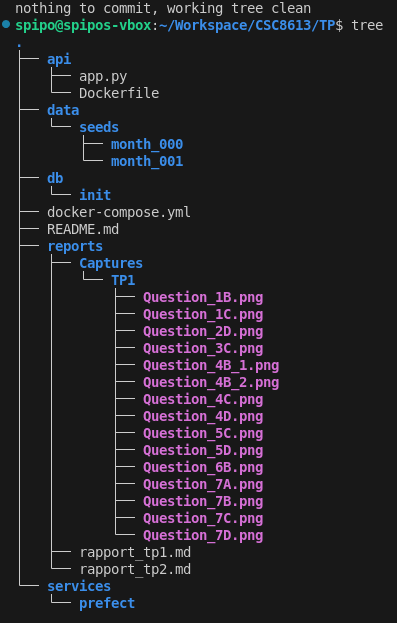
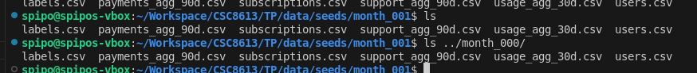
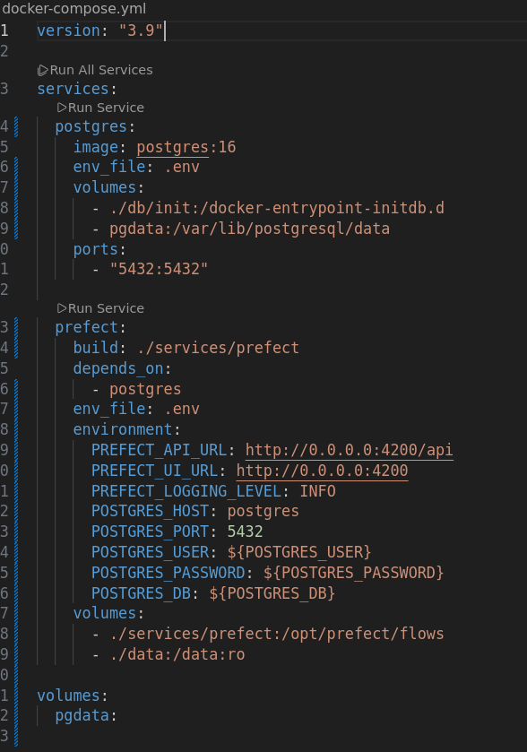

# Exercice 1 : Mise en place du projet et du rapport
## Question 1.a.
Résultat de `git status` : 
```git
spipo@spipos-vbox:~/Workspace/CSC8613/TP$ git status
On branch main
Your branch is up to date with 'origin/main'.

nothing to commit, working tree clean
```
## Question 1.b.
  
_Structure du projet_
## Question 1.c.

_Fichiers importés avec succès_
# Exercice 2 : Base de données et docker-compose
## Question 2.a.
J'ai créé le fichier correctement dans db/init et y ai copié-collé le contenu demandé.
## Question 2.b.
Dans un projet Docker, un fichier `.env` sert à stocker des variables d'environnement qui configurent les services de l'application (dans notre cas les variables d'accès à la base de données).
Ici, ça sépare la définition des variables d'accès PostgreSQL du docker-compose.yml (par rapport à ce qu'on a réalisé au TP 1), ce qui simplifierait leur éventuelle mise à jour/modification sur un projet plus grand.
## Question 2.c.

_Contenu du fichier docker-compose.yml adapté_
## Question 2.d.
```streamflow
streamflow=# \dt
               List of relations
 Schema |       Name       | Type  |   Owner    
--------+------------------+-------+------------
 public | labels           | table | streamflow
 public | payments_agg_90d | table | streamflow
 public | subscriptions    | table | streamflow
 public | support_agg_90d  | table | streamflow
 public | usage_agg_30d    | table | streamflow
 public | users            | table | streamflow
(6 rows)
```
- **users** : Informations basiques, statiques des utilisateurs
- **subscriptions** : Contrats d'abonnement et détails de paiement 
- **users_agg_30d** : Activité récente aggrégée sur les 30 derniers jours
- **payments_agg_30d** : Statuts des paiements sur les 30 derniers jours
- **support_agg_90d** : Interactions avec l'assistance client sur les 90 derniers jours
- **labels** : Variable cible indiquant le taux d'attrition ("churn", la perte de clients).
# Exercice 3 : Upsert des CSV avec Prefect (month_000)
## Question 3.a.
Le conteneur Prefect agit comme chef d'orchestre du pipeline d'ingestion des données. Il se charge de coordonner, planifier, surveiller & exécuter automatiquement les différentes étapes d'ingestion. C'est avec ce conteneur qu'on pourra mettre en place l'ingestion mensuelle demandée.
## Question 3.b.
La fonction upsert_csv charge un fichier CSV dans une table PostgreSQL en appliquant une stratégie d’upsert, c’est‑à‑dire insertion ou mise à jour si la ligne existe déjà.
- Le fichier est chargé avec pandas et certains types sont convertis lorsque nécessaire
- Une table temporaire est créée dynamiquement dans PostgreSQL avec le même schéma que le DataFrame
- Le DataFrame est inséré automatiquement dans cette table temporaire
- UN `INSERT INTO … SELECT … FROM tmp` est exécuté
- La fonction renvoie combien de lignes ont été traitées
## Question 3.c.
Résultats des requêtes SQL : 
```streamflow
streamflow=# SELECT COUNT(*) FROM users;
 count 
-------
  7043
(1 row)

streamflow=# SELECT COUNT(*) FROM subscriptions;
 count 
-------
  7043
(1 row)
```
Visiblement, on a autant d'abonnements que d'utilisateurs.
# Exercice 4 : Validation des données avec Great Expectations
## Question 4.a.
`validate_with_ge` est l'étape du pipeline qui vérifie la qualité des données juste après leur ingestion et avant qu'elles ne soient utilisées ailleurs.
Concrètement, elle charge un échantillon de la table depuis PostgreSQL, applique des règles de qualité Great Expectations adaptées à chaque table (colonnes obligatoires, non-nullité de certaines clés, valeurs numériques >= 0, cohérence du schéma) et fait échouer le flow Prefect si les données sont invalides.
## Question 4.b.
```docker
spipo@spipos-vbox:~/Workspace/CSC8613/TP$ docker compose exec   -e SEED_DIR=/data/seeds/month_000   -e AS_OF=2024-01-31   prefect python ingest_flow.py
09:12:23.343 | INFO    | Flow run 'orthodox-toucanet' - Beginning flow run 'orthodox-toucanet' for flow 'ingest_month'
09:12:23.355 | INFO    | Flow run 'orthodox-toucanet' - View at http://0.0.0.0:4200/runs/flow-run/2d2e8619-17c9-45d0-8369-59575e39032c
09:12:23.842 | INFO    | Task run 'upsert_csv-c7b' - Finished in state Completed()
09:12:24.243 | INFO    | Task run 'upsert_csv-005' - Finished in state Completed()
09:12:24.594 | INFO    | Task run 'upsert_csv-2fd' - Finished in state Completed()
09:12:24.961 | INFO    | Task run 'upsert_csv-2ea' - Finished in state Completed()
09:12:25.221 | INFO    | Task run 'upsert_csv-d3f' - Finished in state Completed()
09:12:25.463 | INFO    | Task run 'upsert_csv-76a' - Finished in state Completed()
09:12:27.096 | INFO    | Task run 'validate_with_ge-786' - Finished in state Completed()
09:12:27.230 | INFO    | Task run 'validate_with_ge-c90' - Finished in state Completed()
09:12:27.361 | INFO    | Task run 'validate_with_ge-ba9' - Finished in state Completed()
09:12:27.402 | INFO    | Flow run 'orthodox-toucanet' - Finished in state Completed()
```
La pipeline s'est visiblement bien terminée sans erreur.
## Question 4.c.
### Validation des données
```python
gdf.expect_table_columns_to_match_set([
            "user_id",
            "watch_hours_30d",
            "avg_session_mins_7d",
            "unique_devices_30d",
            "skips_7d",
            "rebuffer_events_7d"
        ])
        gdf.expect_column_values_to_not_be_null("user_id")
        gdf.expect_column_values_to_be_between("watch_hours_30d", min_value=0)
        gdf.expect_column_values_to_be_between("avg_session_mins_7d", min_value=0)
        gdf.expect_column_values_to_be_between("unique_devices_30d", min_value=0)
        gdf.expect_column_values_to_be_between("skips_7d", min_value=0)
        gdf.expect_column_values_to_be_between("rebuffer_events_7d", min_value=0)
```
J’ai choisi des bornes comme `watch_hours_30d ≥ 0` parce que ces indicateurs représentent des agrégats d’usage (durée visionnée, nombre de sessions, événements, etc.), et ils ne peuvent jamais être négatifs dans la réalité. Une durée négative ou un nombre d’événements négatif serait mathématiquement impossible.

Ces règles protègent le futur modèle en empêchant l’injection de données corrompues (exports tronqués, conversions de type erronées, erreurs d’ETL) qui pourraient fausser les statistiques ou biaiser l’entraînement. Par exemple, une valeur -12 heures dans `watch_hours_30d` pourrait influencer une moyenne, un modèle de churn ou une normalisation, et produire des prédictions instables/absurdes. En bloquant immédiatement ces valeurs impossibles, on garantit que le modèle sera entraîné sur des données cohérentes et propres.
# Exercice 5 : Snapshots et ingestion month_001
## Question 5.a.
`snapshot_month` crée des snapshots temporels pour figer les données à la fin de chaque mois.
Le `as_of` est un horodatage qui indique "cet instantané représente les données telles qu'elles existaient à cette date précise". Cette date est passée en paramètre et détermine le point de coupure du snapshot.
## Question 5.b.
```streamflow
streamflow=# SELECT COUNT(*) FROM subscriptions_profile_snapshots WHERE as_of = '2024-01-31';
 count 
-------
  7043
(1 row)

streamflow=# SELECT COUNT(*) FROM subscriptions_profile_snapshots WHERE as_of = '2024-02-29';
 count 
-------
  7043
(1 row)

streamflow=# SELECT DISTINCT as_of FROM subscriptions_profile_snapshots;
   as_of    
------------
 2024-02-29
 2024-01-31
(2 rows)
```
On a le même nombre de lignes, car visiblement aucun nouvel ajout n'a été fait entre ces deux dates.
## Question 5.c.
### Synthèse
```
              +---------------------+
              |  Tables "live"      |
              | subscriptions       |
              | usage_agg_30d       |
              | payments_agg_90d    |
              | support_agg_90d     |
              +----------+----------+
                         |
                         v
                (1) Prefect Flow
                         |
                         v
        +-----------------------------------+
        |   INSERT ... SELECT avec as_of    |
        |   et ON CONFLICT DO NOTHING       |
        +-----------------------------------+
                         |
                         v
          +----------------------------------+
          |  Tables de snapshots             |
          |  subscriptions_profile_snapshots |
          |  usage_agg_30d_snapshots         |
          |  payments_agg_90d_snapshots      |
          |  support_agg_90d_snapshots       |
          +----------------------------------+
                         |
                         v
                Modèle ML / Analyses
```
- Pourquoi ne pas entraîner un modèle directement sur les tables live ?
    - Les tables *live* changent en permanence (les anciennes données sont écrasées par des nouvelles). Si on entraînait un modèle dessus, on utiliserait un état "reconstruit", pas celui qui existait réellement à une date donnée.
- Pourquoi les snapshots sont essentiels ?
    - Les snapshots ont plusieurs utilités :
        - Elles figent l'état des données à une date donnée (`as_of`)
        - Elles empêchent le "data leakage" en garantissant que les features utilisées pour entraîner un modèle proviennent uniquement du passé
        - Elles rendent les expériences reproductibles dans le temps, vu qu'on peut relancer un entraînement / une analyse un an plus tard en retrouvant exactement les mêmes données qu'à l'origine.
- Réflexion personnelle
    - Ce que j’ai trouvé le plus difficile a été la mise en place d’un pipeline fiable entre plusieurs tables tout en respectant les clés `(user_id, as_of)` pour éviter les doublons. 
    J’ai aussi eu des erreurs liées à des types incohérents ou à des champs manquants dans les `INSERT ... SELECT`, que j’ai corrigées en validant que les schémas des tables live et snapshot étaient alignés et en ajoutant des contrôles simples (ex. valeurs ≥ 0).  