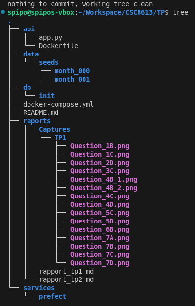

# Exercice 1 : Mise en place du projet et du rapport
## Question 1.a.
Résultat de `git status` : 
```git
spipo@spipos-vbox:~/Workspace/CSC8613/TP$ git status
On branch main
Your branch is up to date with 'origin/main'.

nothing to commit, working tree clean
```
## Question 1.b.
  
## Question 1.c.
