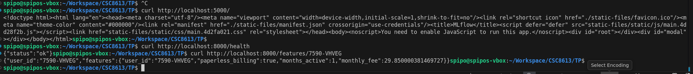
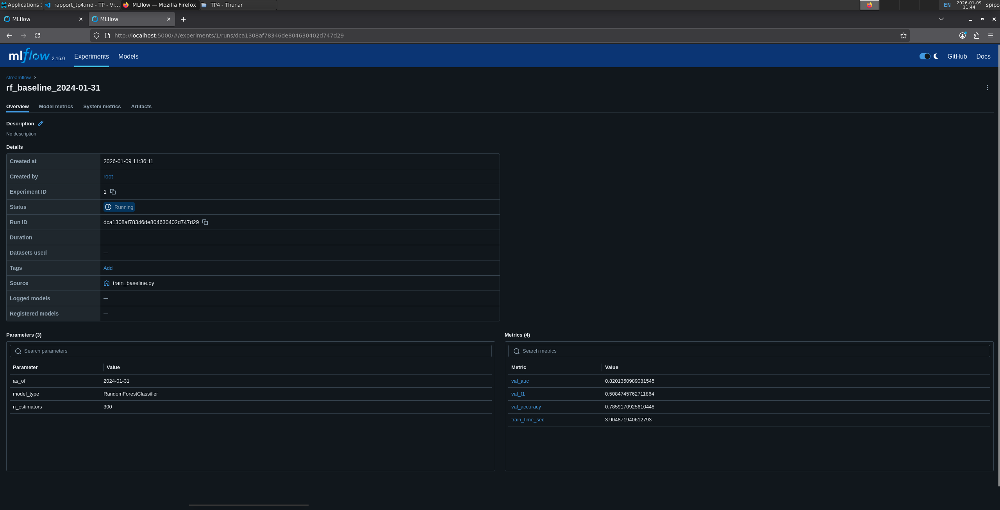
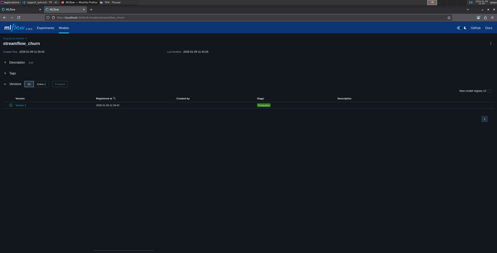

# Exercice 1 : Mise en route + rappel de contexte (sanity checks + où on en est dans la pipeline)
## Question 1.e.
J'ai utilisé les commandes suivantes pour vérifier que tout tourne bien :
- curl http://localhost:5000/
- curl http://localhost:8000/health
- curl http://localhost:8000/features/7590-VHVEG
J'ai aussi testé l'URL http://localhost:5000/ sur mon navigateur web local à ma VM. Ça a affiché une page MLFlow qui fonctionne correctement, comme attendu.

Tout fonctionne comme prévu avec la configuration dans le `docker-compose.yml`, car tout est paramétré correctement.

# Exercice 2 : Créer un script d’entraînement + tracking MLflow (baseline RandomForest)
Il nous faut logger la pipeline complète avec `pipe` plutôt que seulement le modèle avec `clf`, pour plusieurs raisons :
- Le modèle attend des features déjà encodées.
- Le preprocessing (OneHotEncoder + passthrough) fait partie intégrante du modèle.
- En production, MLflow doit pouvoir recevoir les features brutes Feast et appliquer exactement les mêmes transformations.
## Question 2.b.
- J'ai utilisé `AS_OF=2024-01-31`
- Nombre de lignes après merge : 7043
- cat_cols = ["paperless_billing", "plan_stream_tv", "plan_stream_movies", "net_service"]
- `AUC=0.8201 F1=0.5085 ACC=0.7859` et temps d'entraînement : 5.8s
Fixer `AS_OF` permet de figer l’état des données à une date précise et garantit que seules des informations passées sont utilisées lors de l’entraînement, ce qui évite le data leakage. Ça rend les expériences comparables dans le temps, même si les données sources évoluent.
Fixer `random_state` permet de rendre déterministes les étapes aléatoires du pipeline (splits, initialisation du modèle). Deux exécutions avec les mêmes données et paramètres produisent alors exactement les mêmes résultats.

# Exercice 3 : Explorer l’interface MLflow et promouvoir un modèle
## Question 3.f.
Capture du run sur MLFlow :

Capture du Model Registry :

Il s'agit de la version 1
## Question 3.g.
La promotion via une interface de stages (None, Staging, Production) impose un processus formel et traçable de passage en production des modèles. Elle permet de conserver un historique clair des versions déployées, avec leurs métriques et métadonnées associées.  
Contrairement à un déploiement manuel par fichiers ou chemins locaux, elle réduit fortement les erreurs humaines et les incohérences d’environnement. Les transitions entre stages peuvent être contrôlées, auditées et éventuellement soumises à validation.  
En somme, ce mécanisme facilite le rollback, la reproductibilité et l’alignement avec les bonnes pratiques MLOps.

# Exercice 4 : Étendre l’API pour exposer /predict (serving minimal end-to-end)
